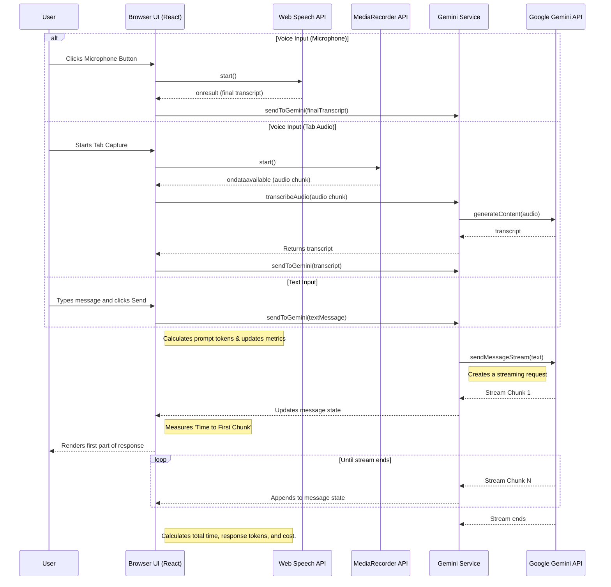

# Gemini Real-time Voice Assistant - Full Documentation

A multimodal, real-time AI assistant that listens to your voice or accepts text input and responds in text. It supports conversation history, custom system prompts, and file attachments for personalized interactions, all powered by the Google Gemini API.

---

## Features

-   **Dual Input Modes**: Seamlessly switch between voice and text input. The UI features a comprehensive input bar with a microphone button and a dynamic-height text area. This can be toggled to a voice-only floating button for a minimal interface.
-   **File Attachments for Context**: Provide files directly to the assistant for context. Supported formats include:
    -   **Images**: (JPG, PNG, WebP) for visual analysis.
    -   **Documents**: (PDF, DOCX) and plain text (.TXT). The app securely parses these on the client-side to extract text content.
-   **Transcribe Browser Tab Audio**: A powerful feature for transcribing audio from another browser tab (e.g., a meeting, webinar, or video).
    -   **Gemini API Method (Default)**: The app directly captures the tab's audio stream, records it in chunks, and sends it to the Gemini API for highly accurate, real-time transcription. This requires no external software.
    -   **Virtual Device Method (Legacy)**: For advanced users or specific use cases, the app retains the ability to listen to a virtual audio device (like VB-Cable or BlackHole) that you configure manually.
-   **Modern, Interactive Settings Panel**: A redesigned UI for configuration, organized into clean, card-based sections.
    -   **Click-to-Edit Prompts**: System prompts are displayed as clean text and transform into an editable area on-demand, saving space.
    -   **Microphone Selection**: Choose your preferred audio input device from a dropdown list of available microphones.
-   **Integrated Session Metrics**: The performance and cost metrics are now integrated as a collapsible section within the settings panel, removing the need for a separate modal.
-   **Real-time Voice Transcription**: Uses the browser's native Web Speech API to transcribe your voice into text as you speak.
-   **Streaming AI Responses**: Receives and displays responses from the Gemini model in real-time, creating a fluid conversational experience.
-   **Customizable AI Persona**: Use the "System Prompt" to define the assistant's personality, role, and response style.
-   **Contextual Awareness**: Provide "Personalization Data" to give the AI private context (like your name or project details) for more relevant answers.
-   **Responsive UI**: A clean, intuitive interface built with React and Tailwind CSS that works on various screen sizes.

## Architecture & Tech Stack

The application is a client-side single-page application (SPA).

-   **Frontend Framework**: **React 19** with TypeScript.
-   **Styling**: **Tailwind CSS** for a utility-first styling workflow.
-   **AI Integration**: **Google Gemini API** via the `@google/genai` SDK.
    -   **Model**: `gemini-2.5-flash` is used for both chat and audio transcription.
-   **Voice Recognition**: **Web Speech API**, a browser-native API for speech-to-text.
-   **Tab Audio Capture**: **Screen Capture API** (`getDisplayMedia`) to capture audio streams from other browser tabs, combined with the **MediaRecorder API** to record the stream for transcription.
-   **Document Parsing**:
    -   **PDF.js**: For client-side parsing of PDF files.
    -   **Mammoth.js**: For client-side extraction of text from DOCX files.
-   **Containerization**: **Docker** with **Nginx** for serving the static files and injecting the API key at runtime.

## Application Flow

## APIs and Services

### 1. Google Gemini API (`@google/genai`)

-   **Description**: The core AI service that provides conversational intelligence and audio transcription.
-   **Model Used**: `gemini-2.5-flash`
-   **Key Methods**:
    -   `ai.chats.create()`: Initializes a new chat session. It's configured with:
        -   `systemInstruction`: To set the AI's persona.
        -   `history`: To provide initial context from "Personalization Data" and attached files.
        -   `thinkingConfig: { thinkingBudget: 0 }`: An optimization to disable the model's "thinking" phase, significantly reducing latency for a real-time feel.
    -   `chat.sendMessageStream()`: Sends the user's text and returns a stream of response chunks.
    -   `ai.models.generateContent()`: Used for the audio transcription feature, sending an audio blob to the model with a specific prompt to get text back.

### 2. Web Speech API

-   **Description**: A browser-integrated API for voice recognition from a microphone.
-   **Interface**: `window.SpeechRecognition` or `window.webkitSpeechRecognition`.
-   **Key Configuration**:
    -   `continuous = true`: The API continues to listen even after the user pauses.
    -   `interimResults = true`: The API provides real-time, non-final transcripts as the user speaks for immediate feedback.

### 3. Screen Capture API (`getDisplayMedia`) & MediaRecorder API
-   **Description**: A combination of APIs used to implement the direct tab audio transcription feature.
-   **Security**: `getDisplayMedia` is highly secure and requires explicit user permission for each use. The user must choose to share a tab and enable "Share tab audio."
-   **Implementation**:
    1.  The app calls `getDisplayMedia({ audio: true })` to get a `MediaStream` from a user-selected tab.
    2.  This stream is then passed to a `MediaRecorder` instance.
    3.  The `MediaRecorder` captures the audio in chunks (e.g., every 5 seconds).
    4.  Each audio chunk is base64-encoded and sent to the Gemini API's `generateContent` endpoint for transcription.
    5.  The resulting text is fed into the chat, creating a continuous, near-real-time transcription.

## Logging & Debugging

The application is instrumented with a custom logger (`utils/logger.ts`) that outputs detailed information to the browser's developer console. This is the primary tool for debugging and understanding the application's behavior.

-   **How to Use**: Open your browser's Developer Tools (usually by pressing F12 or Ctrl+Shift+I) and select the "Console" tab.
-   **Log Levels**:
    -   `[INFO]`: General application events, such as starting a new session, initializing the microphone, or attaching a file.
    -   `[WARN]`: Non-critical issues that might indicate a problem, like an unsupported file type or an API stopping unexpectedly.
    -   `[ERROR]`: Critical failures, such as failing to connect to the Gemini API or a browser feature being unsupported.
    -   `[PERF]`: Performance metrics, such as the "time to first chunk" and total response time for AI responses.

By monitoring the console, you can trace the entire lifecycle of a user interaction, from a microphone click to the final rendered response from the AI.

## In-App Configuration

The settings panel provides inputs for real-time configuration of the AI's behavior:

-   **System Prompt**: Defines the AI's role, personality, and constraints.
    -   *Example*: "You are a friendly pirate who speaks in sea shanties."
-   **Personalization Data & Attachments**: Provides specific, private information for the AI to use as context.
    -   *Example Text*: "My name is Captain Jane. My project is codenamed 'Treasure Map'."
    -   *Example Attachments*: Uploading a PDF of project requirements or a DOCX of meeting notes.

## Version History

-   **v2.7.0** (Current)
    -   Updated all documentation to reflect the new tab audio transcription feature and Docker-based deployment.
-   **v2.6.0**
    -   Enhanced logging across all major components for improved debugging.
    -   Added extensive code comments to clarify complex logic (e.g., speech recognition, file parsing, state management).
-   **v2.5.0**
    -   Added "Capture Tab Audio" feature. The app can now capture audio from other tabs and guides the user on how to route this audio for transcription using a virtual input device.
-   **v2.4.0**
    -   Comprehensive update of all documentation, comments, and logs to reflect the latest features.
    -   Corrected all documentation to use `process.env.API_KEY` instead of a UI input.
-   **v2.3.0**
    -   Added microphone selection dropdown in the settings panel.
-   **v2.2.0**
    -   Enhanced textarea to have dynamic height with a scrollable max-height.
-   **v2.1.0**
    -   Modernized the entire "Assistant Configuration" UI with a card-based layout, improved interactivity, and refined aesthetics.
-   **v2.0.0**
    -   Integrated the "Session Metrics" panel as a collapsible section within the settings modal, removing the separate pop-up.
-   **v1.12.0**
    -   Added client-side support for parsing PDF (`pdf.js`) and DOCX (`mammoth.js`) files to extract text for context.
-   **v1.11.0**
    -   Added file attachment capability for images and plain text files.
-   **v1.10.0**
    -   Added a toggleable text input bar, allowing users to type messages. The UI can be switched between text+voice and voice-only modes.
-   **v1.9.0**
    -   Added responsive, collapsible header.
    -   The microphone button is now adaptive to screen size.
-   **v1.8.0**
    -   Removed API key input from the UI in favor of environment variables.
-   **v1.7.0**
    -   Moved "New Session" button to the main application header.
-   **v1.6.0**
    -   Replaced bottom controls panel with floating action buttons.
-   **v1.5.0**
    -   Moved Assistant Configuration into a modal window.
-   **v1.4.0**
    -   Added a toggleable "Session Metrics" panel.
-   **v1.0.0**
    -   Initial release with core features: voice input, streaming text output, and basic settings.