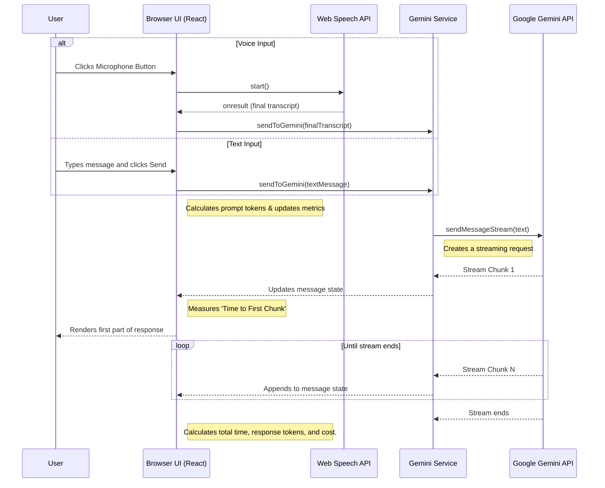

# Gemini Real-time Voice Assistant - Full Documentation

A multimodal, real-time AI assistant that listens to your voice or accepts text input and responds in text. It supports conversation history, custom system prompts, and file attachments for personalized interactions, all powered by the Google Gemini API.

---

## Features

-   **Dual Input Modes**: Seamlessly switch between voice and text input. The UI features a comprehensive input bar with a microphone button and a dynamic-height text area. This can be toggled to a voice-only floating button for a minimal interface.
-   **File Attachments for Context**: Provide files directly to the assistant for context. Supported formats include:
    -   **Images**: (JPG, PNG, WebP) for visual analysis.
    -   **Documents**: (PDF, DOCX) and plain text (.TXT). The app securely parses these on the client-side to extract text content.
-   **Capture Browser Tab Audio**: Listen to and transcribe audio from another browser tab (e.g., a meeting or a video). Due to browser security, this feature guides you to use a system-level audio loopback device (like "Stereo Mix" on Windows or a virtual audio device on macOS) to route the captured audio for transcription.
-   **Modern, Interactive Settings Panel**: A redesigned UI for configuration, organized into clean, card-based sections.
    -   **Click-to-Edit Prompts**: System prompts are displayed as clean text and transform into an editable area on-demand, saving space.
    -   **Hover-to-Reveal**: Long prompts are collapsed by default and expand on hover for a cleaner look.
    -   **Microphone Selection**: Choose your preferred audio input device from a dropdown list of available microphones.
-   **Integrated Session Metrics**: The performance and cost metrics are now integrated as a collapsible section within the settings panel, removing the need for a separate modal.
-   **Real-time Voice Transcription**: Uses the browser's native Web Speech API to transcribe your voice into text as you speak.
-   **Streaming AI Responses**: Receives and displays responses from the Gemini model in real-time, creating a fluid conversational experience.
-   **Customizable AI Persona**: Use the "System Prompt" to define the assistant's personality, role, and response style.
-   **Contextual Awareness**: Provide "Personalization Data" to give the AI private context (like your name or project details) for more relevant answers.
-   **Responsive UI**: A clean, intuitive interface built with React and Tailwind CSS that works on various screen sizes.

## Architecture & Tech Stack

The application is a client-side single-page application (SPA).

-   **Frontend Framework**: **React 19** with TypeScript.
-   **Styling**: **Tailwind CSS** for a utility-first styling workflow.
-   **AI Integration**: **Google Gemini API** via the `@google/genai` SDK.
    -   **Model**: `gemini-2.5-flash` is used for its excellent balance of speed and capability.
-   **Voice Recognition**: **Web Speech API**, a browser-native API for speech-to-text.
-   **Tab Audio Capture**: **Screen Capture API** (`getDisplayMedia`) to capture audio streams from other browser tabs.
-   **Document Parsing**:
    -   **PDF.js**: For client-side parsing of PDF files.
    -   **Mammoth.js**: For client-side extraction of text from DOCX files.

## Application Flow

## APIs and Services

### 1. Google Gemini API (`@google/genai`)

-   **Description**: The core AI service that provides conversational intelligence.
-   **Model Used**: `gemini-2.5-flash`
-   **Key Methods**:
    -   `ai.chats.create()`: Initializes a new chat session. It's configured with:
        -   `systemInstruction`: To set the AI's persona.
        -   `history`: To provide initial context from "Personalization Data" and attached files.
        -   `thinkingConfig: { thinkingBudget: 0 }`: An optimization to disable the model's "thinking" phase, significantly reducing latency for a real-time feel.
    -   `chat.sendMessageStream()`: Sends the user's text and returns a stream of response chunks.

### 2. Web Speech API

-   **Description**: A browser-integrated API for voice recognition.
-   **Interface**: `window.SpeechRecognition` or `window.webkitSpeechRecognition`.
-   **Key Configuration**:
    -   `continuous = true`: The API continues to listen even after the user pauses.
    -   `interimResults = true`: The API provides real-time, non-final transcripts as the user speaks for immediate feedback.
-   **Microphone Control**: The app allows users to select a preferred audio input device, although the browser ultimately controls which device is used.

### 3. Screen Capture API (`getDisplayMedia`)
-   **Description**: Used to capture the contents of a display or part thereof. This app uses it specifically to capture the audio output of another browser tab.
-   **Security**: This API is highly secure and requires explicit, transient user permission for each use. A web application cannot directly process the captured audio stream for transcription with the `Web Speech API`.
-   **Implementation**: The app initiates the capture and then guides the user to manually route the audio using a system-level tool (like a virtual audio device) which can then be selected from the app's microphone list. This respects the browser's security model while enabling the desired functionality.

## In-App Configuration

The settings panel provides inputs for real-time configuration of the AI's behavior:

-   **System Prompt**: Defines the AI's role, personality, and constraints.
    -   *Example*: "You are a friendly pirate who speaks in sea shanties."
-   **Personalization Data & Attachments**: Provides specific, private information for the AI to use as context.
    -   *Example Text*: "My name is Captain Jane. My project is codenamed 'Treasure Map'."
    -   *Example Attachments*: Uploading a PDF of project requirements or a DOCX of meeting notes.

## Version History

-   **v2.5.0** (Current)
    -   Added "Capture Tab Audio" feature. The app can now capture audio from other tabs and guides the user on how to route this audio for transcription using a virtual input device.
-   **v2.4.0**
    -   Comprehensive update of all documentation, comments, and logs to reflect the latest features.
    -   Corrected all documentation to use `process.env.API_KEY` instead of a UI input.
-   **v2.3.0**
    -   Added microphone selection dropdown in the settings panel.
-   **v2.2.0**
    -   Enhanced textarea to have dynamic height with a scrollable max-height.
-   **v2.1.0**
    -   Modernized the entire "Assistant Configuration" UI with a card-based layout, improved interactivity, and refined aesthetics.
-   **v2.0.0**
    -   Integrated the "Session Metrics" panel as a collapsible section within the settings modal, removing the separate pop-up.
-   **v1.12.0**
    -   Added client-side support for parsing PDF (`pdf.js`) and DOCX (`mammoth.js`) files to extract text for context.
-   **v1.11.0**
    -   Added file attachment capability for images and plain text files.
-   **v1.10.0**
    -   Added a toggleable text input bar, allowing users to type messages. The UI can be switched between text+voice and voice-only modes.
-   **v1.9.0**
    -   Added responsive, collapsible header.
    -   The microphone button is now adaptive to screen size.
-   **v1.8.0**
    -   Removed API key input from the UI in favor of environment variables.
-   **v1.7.0**
    -   Moved "New Session" button to the main application header.
-   **v1.6.0**
    -   Replaced bottom controls panel with floating action buttons.
-   **v1.5.0**
    -   Moved Assistant Configuration into a modal window.
-   **v1.4.0**
    -   Added a toggleable "Session Metrics" panel.
-   **v1.0.0**
    -   Initial release with core features: voice input, streaming text output, and basic settings.