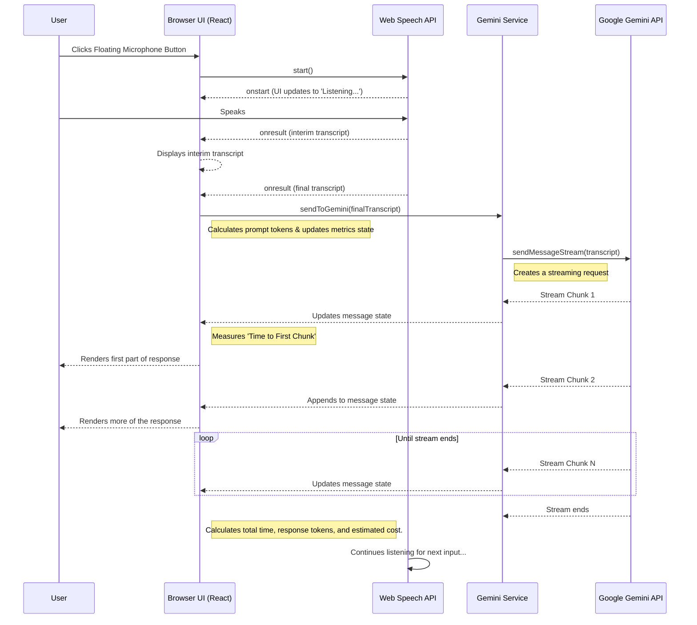

# Gemini Real-time Voice Assistant - Full Documentation

A multimodal, real-time AI assistant that listens to your voice and responds in text. It supports conversation history, custom system prompts, and private data for personalized interactions, all powered by the Google Gemini API.

---

## Features

-   **Responsive UI with Collapsible Header**: The UI is optimized for small screens. The header is hidden by default on narrow viewports and can be revealed with a toggle button, maximizing space for the conversation.
-   **Adaptive Controls**: The main microphone button resizes, appearing smaller on small screens and larger on desktops for better usability.
-   **Easy Configuration & Session Management**: App controls are grouped in the header. Settings are tucked away in a modal window, accessible via a gear icon. The "New Session" button is located right next to it, providing clear, top-level controls.
-   **Intuitive API Key Handling**: The app provides clear, non-intrusive visual cues if the API key is missing:
    -   A red dot appears on the settings icon.
    -   A warning message is displayed in the main conversation area.
    -   The microphone button is visually disabled.
-   **Local API Key Storage**: Set your Gemini API key directly in the UI—it's saved locally in your browser for convenience.
-   **Real-time Voice Transcription**: Uses the browser's native Web Speech API to transcribe your voice into text as you speak.
-   **Streaming AI Responses**: Receives and displays responses from the Gemini model in real-time, creating a fluid conversational experience.
-   **Continuous Conversation**: The assistant can listen continuously, processing spoken commands and questions as they are finalized.
-   **Customizable AI Persona**: Use the "System Prompt" to define the assistant's personality, role, and response style.
-   **Contextual Awareness**: Provide "Personalization Data" to give the AI private context (like your name, interests, or project details) for more relevant answers.
-   **Modern & Responsive UI**: A clean, intuitive interface built with React and Tailwind CSS that works on various screen sizes.
-   **Performance Monitoring**: Built-in logging for key events and performance metrics, such as "time to first chunk" and total response time.
-   **Session Metrics & Info Panel**: A toggleable window that displays:
    -   **Live Performance**: Latency (time to first chunk) and total response time for the last interaction.
    -   **Token Counts**: Estimated token usage for the last prompt and response.
    -   **Session Totals**: Cumulative token counts for the entire conversation.
    -   **Cost Estimation**: A running estimate of the API costs for the current session.
    -   **API Config**: The name of the model currently in use.

## Architecture & Tech Stack

The application is a client-side single-page application (SPA) built with a modern frontend stack.

-   **Frontend Framework**: **React 19** with TypeScript for building the user interface.
-   **Styling**: **Tailwind CSS** for a utility-first styling workflow.
-   **AI Integration**: **Google Gemini API** via the `@google/genai` SDK.
    -   **Model**: `gemini-2.5-flash` is used for its excellent balance of speed and capability, making it ideal for real-time chat.
-   **Voice Recognition**: **Web Speech API**, a browser-native API for speech-to-text conversion.

## Application Flow

The following diagram illustrates the data flow from user input to the AI's response:

## APIs and Services

### 1. Google Gemini API (`@google/genai`)

-   **Description**: This is the core AI service that provides conversational intelligence.
-   **Model Used**: `gemini-2.5-flash`
-   **Key Methods**:
    -   `ai.chats.create()`: Initializes a new chat session. We configure it with:
        -   `systemInstruction`: To set the AI's persona and instructions from the "System Prompt" and "Personalization Data" text areas.
        -   `thinkingConfig: { thinkingBudget: 0 }`: This is a crucial optimization for real-time chat. It disables the model's "thinking" phase, significantly reducing the time to the first token (latency) and making the conversation feel more immediate.
    -   `chat.sendMessageStream()`: Sends the user's transcribed text and returns a stream of response chunks, which are processed to display the answer word-by-word.

### 2. Web Speech API

-   **Description**: A browser-integrated API for performing voice recognition.
-   **Interface**: `window.SpeechRecognition` or `window.webkitSpeechRecognition` (for compatibility).
-   **Key Configuration**:
    -   `continuous = true`: The API continues to listen even after the user pauses, which is essential for an ongoing conversation.
    -   `interimResults = true`: The API provides real-time, non-final transcripts as the user is speaking. This is displayed in the UI to give the user immediate feedback that their speech is being recognized.
-   **Events Handled**:
    -   `onstart`: Fired when recognition begins. Used to update the UI state to `isListening`.
    -   `onend`: Fired when recognition ends. Used to reset state or auto-restart the listener.
    -   `onerror`: Handles recognition errors (e.g., no microphone access).
    -   `onresult`: The core event that provides transcript data, both interim and final.

## In-App Configuration

The UI provides three inputs for real-time configuration of the AI's behavior for the current session:

-   **Gemini API Key**: Your personal API key from Google AI Studio. This is required for the app to function and is saved in your browser's local storage for convenience.
-   **System Prompt**: Defines the AI's role, personality, and constraints.
    -   *Example*: "You are a friendly pirate who speaks in sea shanties."
-   **Personalization Data**: Provides specific, private information for the AI to use as context.
    -   *Example*: "My name is Captain Jane. My project is codenamed 'Treasure Map'."

## Version History

-   **v1.9.0** (Current)
    -   Added a responsive, collapsible header that hides on small screens to maximize space.
    -   Added a toggle button to show/hide the header on small screens.
    -   The floating microphone button is now smaller on small screens and larger on desktops.
-   **v1.8.0**
    -   Improved UX for missing API key state with clearer, non-intrusive visual cues (red dot on settings, highlighted prompt, grayed-out mic).
    -   Removed idle status text (e.g., "Click mic to start") for a cleaner UI.
    -   Increased the size of the microphone button for better usability.
-   **v1.7.0**
    -   Moved "New Session" button from floating controls to the main application header next to the settings icon.
    -   Floating controls now only contain the microphone button.
-   **v1.6.0**
    -   Removed the bottom controls panel to save space.
    -   Integrated controls (microphone, new session) as floating buttons in the bottom-right of the conversation view.
    -   Adjusted layout to ensure floating controls do not obscure conversation text.
-   **v1.5.0**
    -   Enhanced UI for small screens (e.g., 350x250px).
    -   Moved Assistant Configuration into a modal accessible via a new settings icon.
    -   Reduced sizes of buttons, icons, and padding for a more compact layout.
-   **v1.4.0**
    -   Added a toggleable "Session Metrics" panel.
    -   The panel displays performance metrics (latency, response time), estimated token counts, and estimated session cost.
-   **v1.3.0**
    -   Added UI input for Gemini API key.
    -   Key is now saved to and retrieved from browser's local storage.
    -   Updated app logic to dynamically initialize the AI service with the user-provided key.
-   **v1.2.0**
    -   Restructured documentation into `README.md` and `docs/DOCUMENTATION.md`.
-   **v1.1.0**
    -   Added `README.md` with comprehensive documentation.
    -   Added structured logging (`utils/logger.ts`) for events and performance.
    -   Integrated detailed code comments across all components and services.
    -   Added ARIA attributes for improved accessibility.
-   **v1.0.0**
    -   Initial release.
    -   Core features: voice input, streaming text output, conversation history, and settings panel.